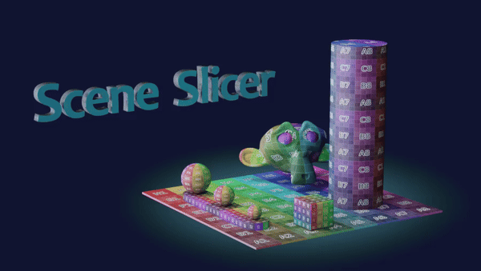

# Blender Decentraland Toolkit: Scene Slicer

This is a Blender plugin for partitioning a collection into a grid of tiles and exporting each tile as a glTF.

It was written for use with the **Infinity Engine** in Decentraland - see the [Decentrally repository](https://github.com/decentraland-scenes/decentrally) for more information.




### Features

* Export tiles to GLtf - supports Draco compression
* Export tileset data to JSON - supports minification
* Configurable tile size and origin

Installation
--
Go to `Edit > Preferences > Addons > Install` and select .zip file .

You can slo clone this repo to your addons folder.

Once installed you can find it in `3D Viewport -> Sidebar -> Scene Slicer`

How to use
--
* Place your scene in a collection
* In the **Scene Slicer** sidebar panel: 
    * Choose your collection in the dropdown 
    * Configure output path (see below)
    * Configure grid size (see below)
    * Click the "Slice and Export" button

### Settings:

The following options are available in the Scene Slicer panel: 

#### Collection to export

* Choose the collection of objects you wish to export
* Click the refresh symbol if your collection is not in the dropdown
* All objects wihin the colelction will be exported - visbility is ignored

#### Output path
* Blender uses `//` for relative paths. 
* Use `//tiles` to output to a folder named `tiles` in current file location. 
* The folder must exist.


#### Grid size

* Suggest using 1/4 parcel size or smaller for good results.
* Grid size must be less than 1/2 your total parcel size. 
* Smaller grid sizes will take longer to process as they contain more tiles. 
* Larger grid sizes will result in the tile being unloaded closer to the player.
* Consider having a larger Z axis (vertical)

### Advanced settings

Some additonal options are available in the "Advanced Settings" panel.

* Toggle minification of the JSON output
* Toggle the use of Draco compression on glTF exports
* Tile origin - set export origin position to use tile min position, tile center, or tile max position


How does it work
--

The addon peforms roughly the following process when the "Export" button is clicked:

* Work out grid size and origin based on collection bounding box
* Work out bounding boxes for all objects in collection
* Loop through each grid tile and check for objects with intersecting bounding boxes (see [caveat #1](#known-issues-limitations-and-caveats))
* Duplicate all objects in the tile, which:
    * Adds an intersection boolean to limit the geometry to the tile bounds
    * Adds a triangulate modifier
    * Applies all modifiers (mirrors, bevels, etc)
    * Updates the objects origin (see [Advanced settings - Tile origin](#advanced-settings))
* Double check we have some mesh data in the tile after applying all the bools
* Export the duplicated objects and remove them


Tileset JSON
---

> **NOTE:** Positions and indexes are in XYZ order, with Z representing the vertical (up) axis

The addon exports a JSON structure describing the tileset to `tileset.json`.  
It contains the following information:

```js
{
	"name"           : "park",            // Name of the tileset (the collection name)
	"tileset_size"   : [ 7,   6,   2   ], // The total size (in tiles) of the tileset
	"tileset_origin" : [ 0.0, 0.0, 0.0 ], // The origin position of the tileset
	"tile_dimensions": [ 8.0, 8.0, 4.0 ], // The size (in Blender units) of each tile
	"tile_format"    : "GLTF_SEPARATE",   // glTF format, possible values are GLB, GLTF_SEPARATE
	"tile_origin"    : "CENTER",          // Tile origin, possible values are CENTER, TILE_MIN, TILE_MAX
	"tiles"          : [                  // A nested array of tiles 
		[
			[
				{ 
					"index"     : [ 0, 0, 0 ],       // The index of this tile in the tiles array
					"src"       : "tile_0_0_0",      // The gltf filename. File extension derived from tile_format 
					"pos_center": [ 4.0, 4.0, 2.0 ], // The tile center 
					"pos_min"   : [ 0.0, 0.0, 0.0 ], // The minimum bounds of this tile
					"pos_max"   : [ 8.0, 8.0, 4.0 ]  // The maximum bounds of the tile
				}, // ... etc, for each tile
			],
		],
	]
}
```

Known issues, limitations and caveats:
--

1) Tile occupancy is determined by rectangular bounding boxes, this can result in tiles being incorrectly considered to be "occupied" and processed when they do not contain any mesh data. However, a tri-count is done after applying all modifiers and tiles with 0 tris are skipped. This *mostly* works, but sometimes can result in blank tiles.
1) Does not support Curves
1) Object visibility is ignored - if it's in the collection, it gets exported

ToDo:
--
[ ] Add option to flip tileset.json YZ on export  
[ ] Make all colelctions objects visible to avoid error with exporter  
[ ] Add a way for user to interrupt process  
[ ] Stop UI from locking up  
[ ] Allow user to export individual tiles  
[ ] Add batch-exporter  
[ ] Move tiles to own groups  
[ ] Parent tile objects to an empty for easier management?  