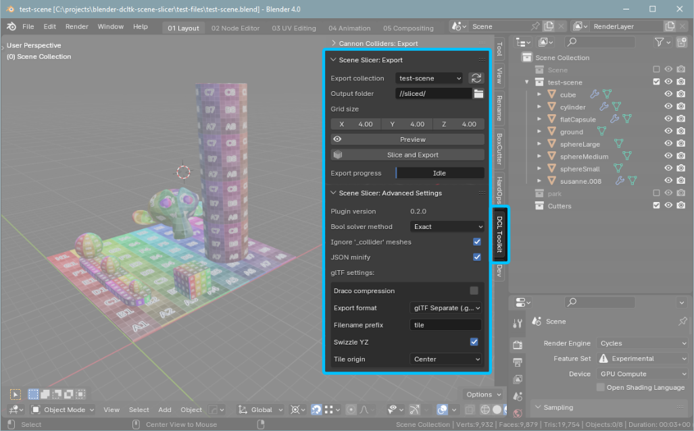

# Blender Decentraland Toolkit: Scene Slicer

This is a Blender (4.0 or higher) plugin for partitioning a collection of objects into a grid of tiles, and  exporting each tile as a glTF.

It was written for use with the **Infinity Engine** in Decentraland - see the [Decentrally repository](https://github.com/decentraland-scenes/decentrally) for more information.


### Features

* It slices, it dices, and it exports to glTF!
* Supports Draco compression
* Exports tileset data to JSON
* Configurable tile size and origin

Installation
--
* Download the latest version from the [Releases](/releases) page
* In Blender, go to `Edit > Preferences > Addons > Install`
* Select the .zip file
* Once installed ensure the plugin is activated (ticked) in the list of Addons

The plugin panel can be found in `3D Viewport -> Sidebar -> DCL Toolkit -> Scene Slicer`



How to use
--
* Place your scene in a collection
* In the **"DCL Toolkit"** sidebar panel, under **"Scene Slicer: Export"**: 
    * Choose your collection in the dropdown 
    * Configure output path (see below)
    * Configure grid size (see below)
    * Click the "Preview" button and check the grid layout
    * Click the "Slice and Export" button
    * The glTF and tileset.json files will be exported
    * You can cancel the Slice by pressing escape
    * You can delete the `_sliced` collection that is created after verifying the scene was properly sliced


### Tips

* You can press `Esc` to cancel the Slice
* Ensure objects are in positive positions on all axis, eg above the ground (Z+), as well as X+ and Y+, relative to the world origin
* Avoid excessively high poly-counts - tile creation can take several seconds per-tile in excessively complicated scenes, resulting in extended slicing times.
* Avoid having vertexs at the intersections of tiles as this can cause problems with the booleans.  
Eg, don't have the floor at 0 as this will intersect/align with the bottom of the grid. Raise it slightly to avoid problems. If you're getting weird artefacts and janky meshes when slicing, it's most likely due to a bad mesh or vertexs aligning perfectly with the edge of a tile.

### Settings:

The following options are available in the Scene Slicer panel: 

* **Export collection**

    * Choose the collection of objects you wish to export
    * Click the refresh symbol if your collection is not in the dropdown
    * All objects within the collection will be exported - visbility is ignored

* **Output folder**
    * Blender uses `//` for relative paths
    * Use `//tiles` to output to a folder named `tiles` in current file location
    * The glTF files and the `tileset.json` file describing the tileset will be exported here


* **Grid size**

    * Suggest using 1/4 parcel size or smaller for good results
    * Grid size must be less than 1/2 your total parcel size
    * Smaller grid sizes will take longer to process as they contain more tiles
    * Larger grid sizes will result in the tiles being unloaded closer to the player
    * Consider having a larger vertical axis
    * Click the "Preview" button to visualise the slicing grid

### Advanced settings

Some additonal options are available in the "Advanced Settings" panel.

* **Bool solver method**:  
Choose between Exact or Fast - Exact has better results but slower performance.

* **Ignore '_collider' meshes**:  
If enabled, ignore any meshes with `_collider` in the name.

* **JSON minify**:  
Significantly reduces JSON export file size - disable for dev; enable for production.

* **glTF**:  
    * **Draco compression**:  
    Toggle the use of Draco compression on glTF exports. Note that most 3D viewers do not support Draco. Disable for dev; enable for production.

    * **Export format**:  
    Choose between GLB or GLTF Separate. Recommend GLTF as it supports externalised textures.

    * **Filename prefix**:  
    Specify naming convention for output files.

    * **Swizzle XY**:  
    Export to Y+ up - this applies to both the glTF files and the `tileset.json`. Recommend enabled at all times, unless you know what you're doing.

    * **Tile origin**:  
    Set the origin position for exported tiles, can be min, center, or max. Recommend using "Center".


How does it work
--

The addon peforms roughly the following process when the "Export" button is clicked:

* Work out bounding boxes for all objects in collection
* Work out grid size and origin based on overall collection bounding box
* Loop through each grid tile and check for objects with intersecting bounding boxes (see [caveat #1](#known-issues-limitations-and-caveats))
* Duplicate all objects in the tile, which:
    * Adds an intersection boolean to limit the geometry to the tile bounds
    * Adds a triangulate modifier
    * Applies all modifiers (mirrors, bevels, etc)
    * Updates the objects origin (see [Advanced settings - Tile origin](#advanced-settings))
* Double check we have some mesh data in the tile after applying all the bools
* Export the duplicated objects and remove them


Tileset JSON
---

> **NOTE:** Positions and indexes are in XYZ order, with Z representing the vertical (up) axis unless **Swizzle YZ** is enabled, to enable Y+ up

The addon exports a JSON structure describing the tileset to `tileset.json`. It contains the following information:

```js
{
    "version"        : "0.2.0",           // Version of plugin used to export tileset
    "name"           : "park",            // Name of the tileset (the collection name)
    "tileset_size"   : [ 7,   6,   2   ], // The total size (in tiles) of the tileset
    "tileset_origin" : [ 0.0, 0.0, 0.0 ], // The origin position of the tileset
    "tile_dimensions": [ 8.0, 8.0, 4.0 ], // The size (in Blender units) of each tile
    "tile_format"    : "GLTF_SEPARATE",   // glTF format, possible values are GLB, GLTF_SEPARATE
    "tile_origin"    : "CENTER",          // Possible values are CENTER, TILE_MIN, TILE_MAX
    "tiles"          : [                  // A nested array of tiles 
        [
            [
                { 
                    "index"     : [ 0, 0, 0 ],       // The index of this tile in the tiles array
                    "src"       : "tile_0_0_0",      // glTF filename, extension set by tile_format 
                    "pos_center": [ 4.0, 4.0, 2.0 ], // The tile center 
                    "pos_min"   : [ 0.0, 0.0, 0.0 ], // The minimum bounds of this tile
                    "pos_max"   : [ 8.0, 8.0, 4.0 ]  // The maximum bounds of the tile
                }, // ... etc, for each tile
            ],
        ],
    ]
}
```

Known issues, limitations and caveats:
--

1) Tile occupancy is determined by rectangular bounding boxes, this can result in tiles being incorrectly considered to be "occupied" and processed when they do not contain any mesh data.  
A basic tri-count is done after applying all modifiers and tiles with 0 tris are skipped. This *mostly* works, but sometimes can result in blank tiles.
1) Does not support Curves
1) Object visibility is ignored - if it's in the collection, it gets exported

ToDo:
--
[x] Add option to flip tileset.json YZ on export  
[x] Add version number to panel/JSON
[x] Add a way for user to interrupt process  
[x] Stop UI from locking up  
[ ] Make all collections objects visible to avoid error with exporter  
[ ] Allow user to export individual tiles  
[ ] Add batch-exporter  
[ ] Move tiles to own groups  
[ ] Parent tile objects to an empty for easier management?  
